# Advanced SQL Queries

A MySQL lab demonstrating table creation, data insertion, filtering, sorting, aggregation, grouping, and table modification operations.

## Concepts Practiced

- CREATE TABLE
- INSERT INTO
- SELECT
- WHERE
- ORDER BY
- DISTINCT
- LIKE
- BETWEEN
- Aggregate Functions (COUNT, AVG, SUM)
- GROUP BY
- HAVING
- ALTER TABLE
- CONCAT

## Files

- `Advanced SQL Queries.sql` - Complete SQL script
- Screenshots showing query execution and results

---

## Step 1: Create Employee Table and Insert Records

Creates the Employees table and inserts sample employee data.

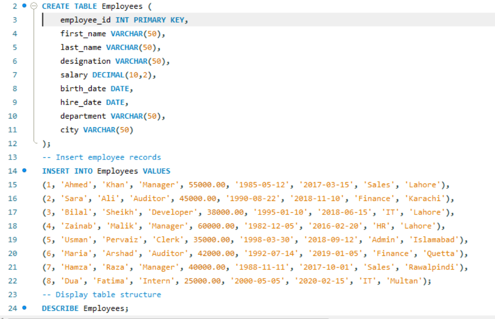

---

## Step 2: View Table Structure

Displays all columns and datatypes in the Employees table.

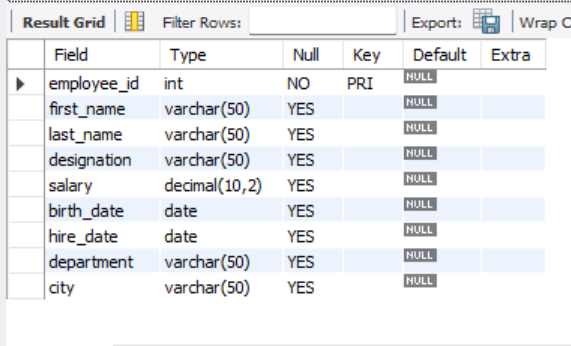

---

## Step 3: Display Selected Employee Details

Shows employee names, designations, and departments.

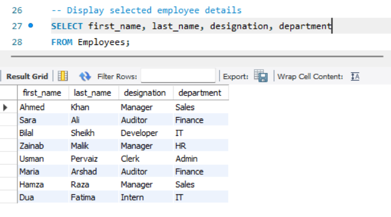

---

## Step 4: Display Employees Ordered by Hire Date

Lists employees sorted by hire date in descending order.

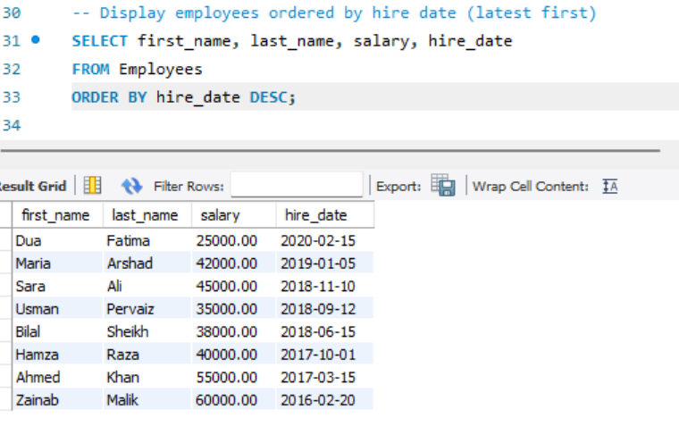

---

## Step 5: Display Unique Departments

Uses DISTINCT to show unique department names.

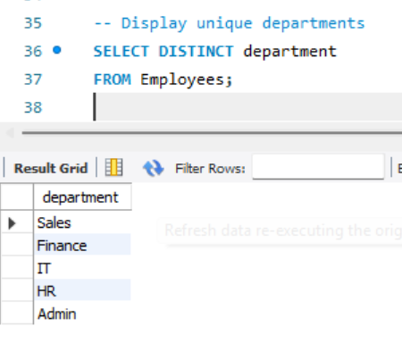

---

## Step 6: Employees Earning Less Than 40000 Hired During 2018

Uses WHERE and BETWEEN conditions.

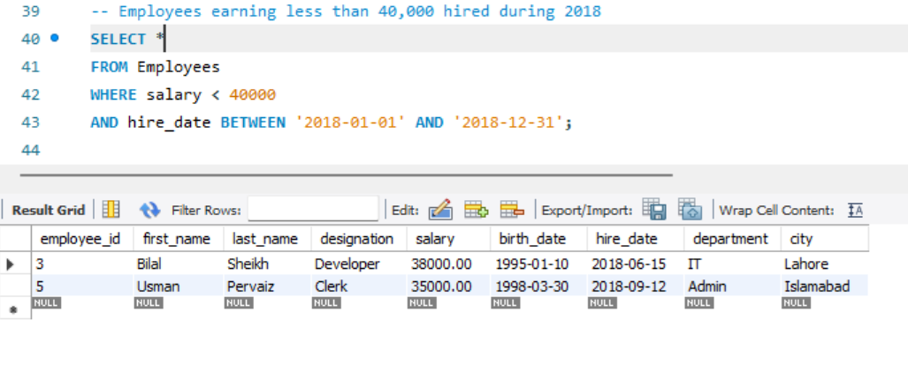

---

## Step 7: Cities Containing Letter 'r' or 'i'

Uses LIKE operator for pattern matching.

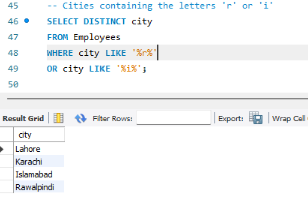

---

## Step 8: Employees Hired Between Specified Dates

Filters employees using date ranges and sorts results.

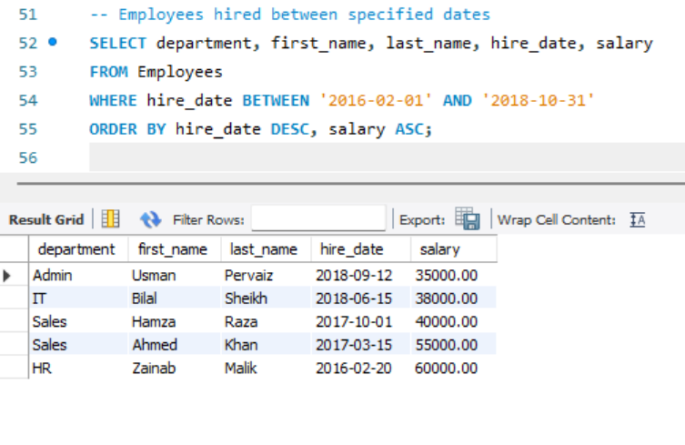

---

## Step 9: Managers Located in Lahore

Uses multiple WHERE conditions.

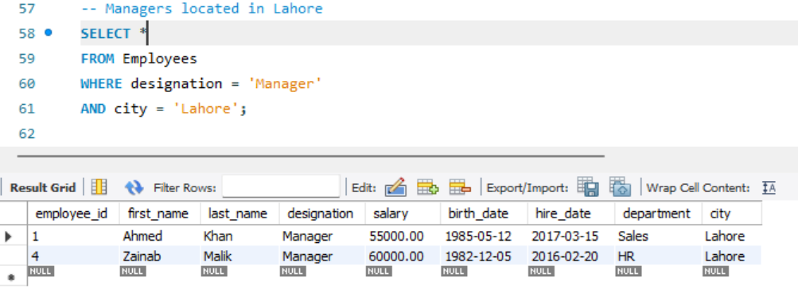

---

## Step 10: Calculate Bonus and New Salary

Calculates a 20% bonus and updated salary using expressions.

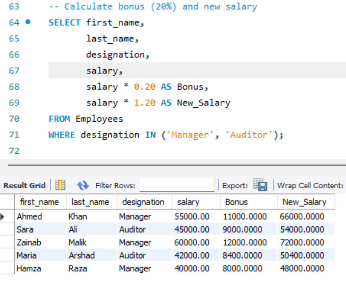

---

## Step 11: Add Full Name Column

Modifies table structure by adding a new column.

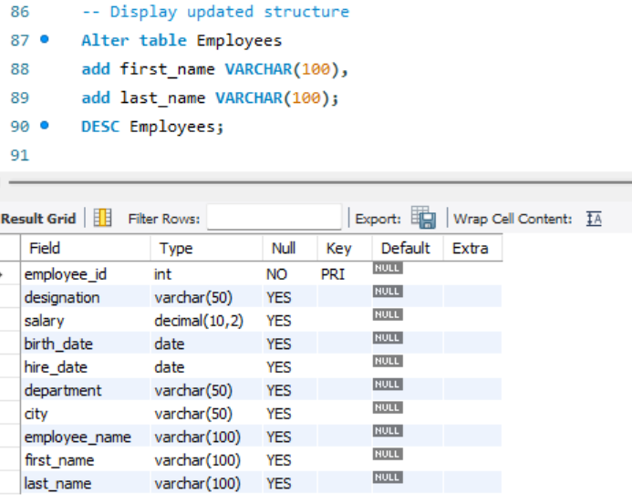

---

## Step 12: Populate Full Name Using CASE Statement

Updates employee_name values for existing records.

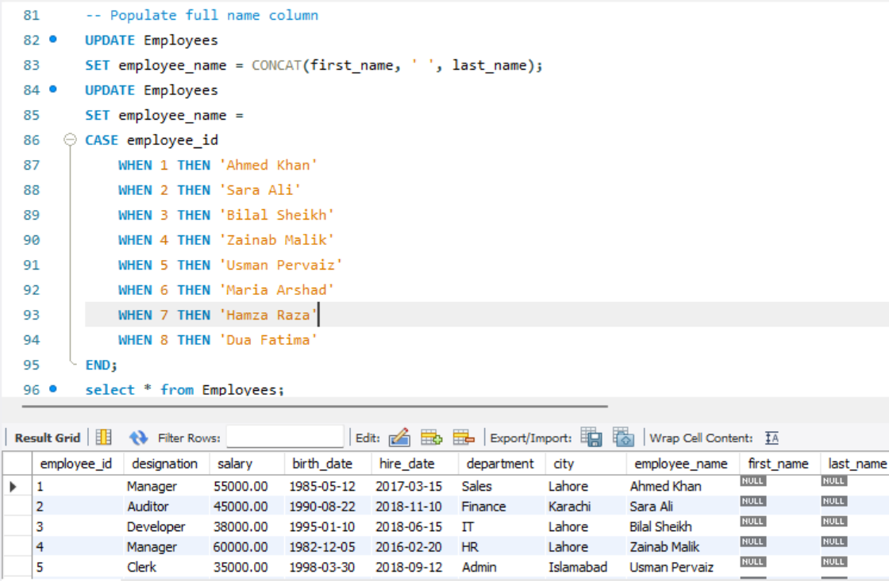

---

## Step 13: Display Concatenated Employee Details

Uses CONCAT to combine employee information into a single string.

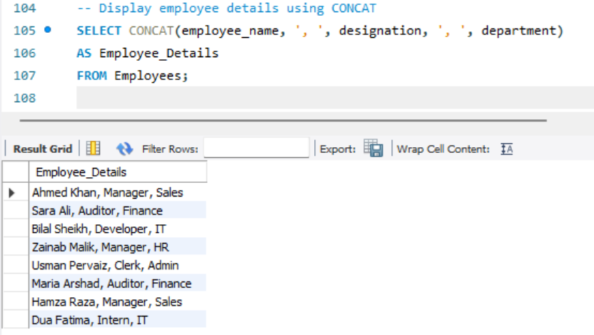

---

## Step 14: Count Total Auditors

Uses COUNT() to determine the number of auditors.

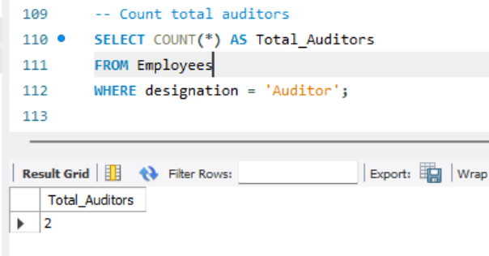

---

## Step 15: Count Employees by City and Department

Uses GROUP BY and COUNT().

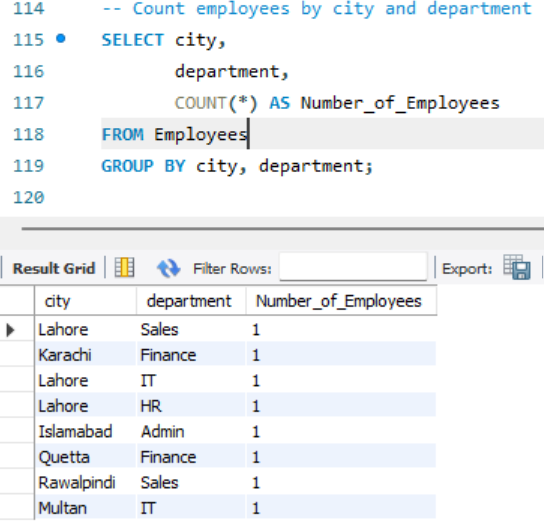

---

## Step 16: Average Salary by Department

Uses AVG() with GROUP BY.

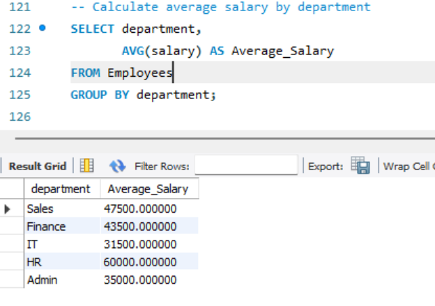

---

## Step 17: Count Long-Term Employees

Counts employees with more than 8 years of service.

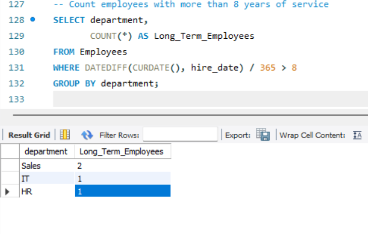

---

## Step 18: Total Salary Expense by Designation

Uses SUM() and GROUP BY.

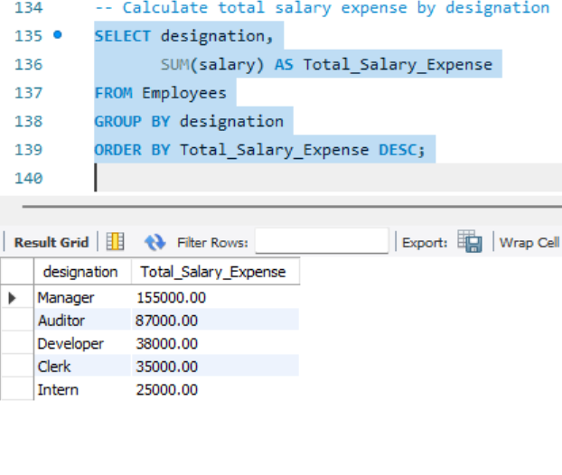

---

## Step 19: Count Total Employees

Displays the total number of employee records.

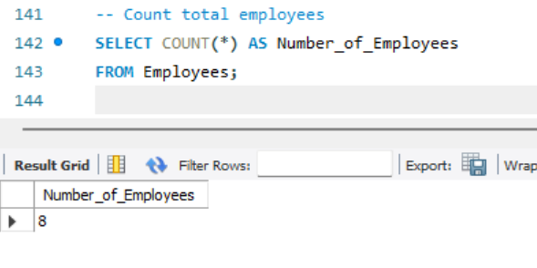

---

## Step 20: Average Salary by City and Department

Uses GROUP BY and HAVING clause.

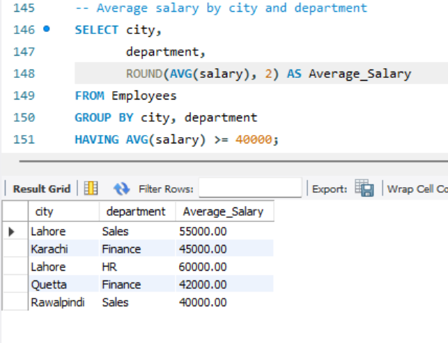

---

## Additional Work

The following screenshots document schema modification attempts and syntax troubleshooting during development:

- add full name column syntax error.png
- drop first last name and add full name column.png

These were included for learning and debugging purposes.

## Technologies Used

- MySQL
- SQL
- MySQL Workbench

## Learning Outcomes

This lab demonstrates practical use of SQL queries for:

- Data retrieval
- Filtering and sorting
- Aggregate functions
- Grouping data
- Table modification
- String manipulation
- Database analysis
