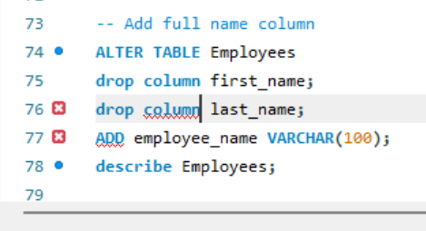

# Advanced SQL Queries
# Test

A MySQL lab demonstrating employee database creation, data retrieval, filtering, sorting, aggregation, grouping, and table modification operations.

## Concepts Practiced

- CREATE TABLE
- INSERT INTO
- SELECT
- WHERE
- ORDER BY
- DISTINCT
- LIKE
- BETWEEN
- COUNT()
- AVG()
- SUM()
- GROUP BY
- HAVING
- ALTER TABLE
- CONCAT()

---

## 1. Create Employees Table and Insert Records

Creates the Employees table and inserts sample employee data.

---

## 2. Describe Employees Table

Displays the table structure and column information.

---

## 3. Display Selected Employee Details

Retrieves employee names, designations, and departments.

---

## 4. Display Employees Ordered by Hire Date

Sorts employees by hire date in descending order.

---

## 5. Display Unique Departments

Uses DISTINCT to retrieve unique departments.

---

## 6. Employees Earning Less Than 40000 Hired During 2018

Filters employees using salary and hire date conditions.

---

## 7. Cities Containing 'r' or 'i'

Uses the LIKE operator for pattern matching.

---

## 8. Employees Hired Between Specified Dates

Uses BETWEEN and ORDER BY.

---

## 9. Managers Located in Lahore

Filters employees using multiple conditions.

---

## 10. Calculate Bonus and New Salary

Calculates a 20% bonus and updated salary.

---

## 11. Add Full Name Column

Demonstrates ALTER TABLE operations.

---

## 12. Populate Full Name Values

Updates employee_name values using a CASE statement.

---

## 13. Display Concatenated Employee Details

Uses CONCAT() to combine employee information.

---

## 14. Count Total Auditors

Counts all auditors in the database.

---

## 15. Count Employees by City and Department

Uses GROUP BY with COUNT().

---

## 16. Average Salary by Department

Uses AVG() with GROUP BY.

---

## 17. Count Long-Term Employees

Counts employees with more than 8 years of service.

---

## 18. Total Salary Expense by Designation

Uses SUM() and GROUP BY.

---

## 19. Count Total Employees

Returns the total number of employees.

---

## 20. Average Salary by City and Department

Uses GROUP BY and HAVING.

---

## Additional Work

The following screenshots document table modification attempts and troubleshooting during development:

### Syntax Error While Adding Full Name Column

### Drop First and Last Name Columns and Add Full Name Column

---

## Technologies Used

- MySQL
- SQL
- MySQL Workbench

## Learning Outcomes

This project demonstrates:

- Data retrieval and filtering
- Sorting records
- Aggregate functions
- Grouping and analysis
- Table modification
- String manipulation with CONCAT()
- Basic database management
